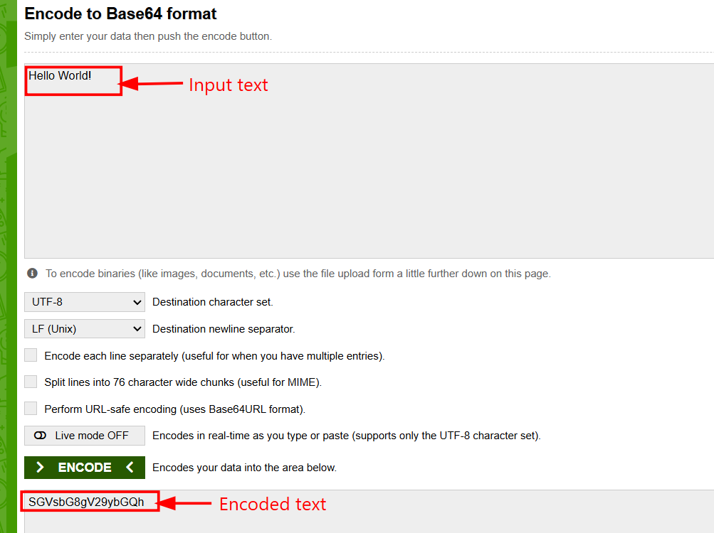
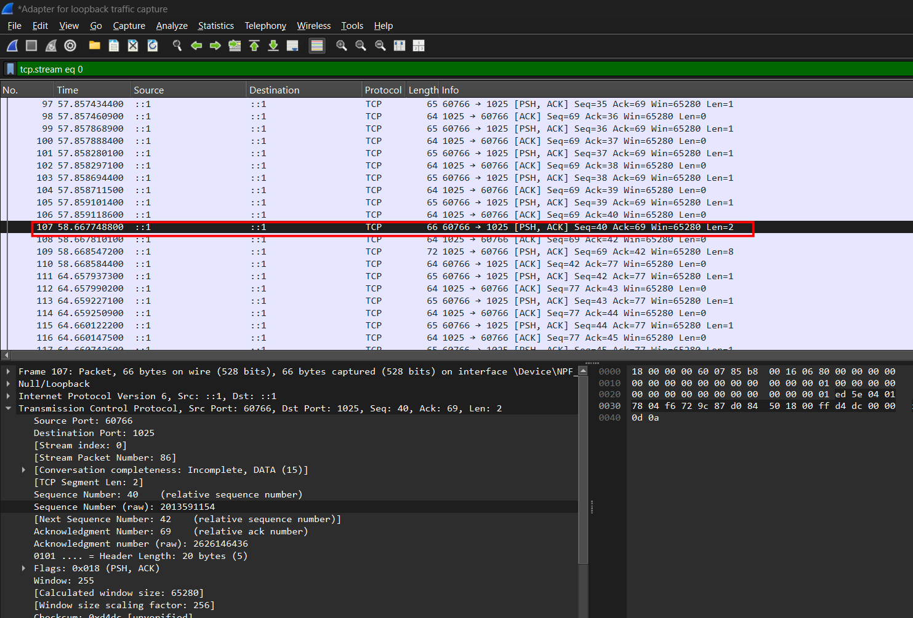

# Introduction
We will be exploring how Base64 works in the SMTP (simple mail transfer protocal) for converting raw binary data like images into text for transmission in the network.

## tools used
1. Base64 one
2. Wireshark 

## Procedure 

## Step 1: opening the Base64 one and inserting the data.

At first we will open the Base64 one application. It is a free application to show how data is converted into ASCII text using Base64 encoding.
 


 
## Step 2: Inserting the data and encoding it int the base64 format.
After opening the tool we will input the text and encode it in the Base64 format. 



## Step 3: Opening the wireshark in loopback mode and filtering the packages for SMTP.
We have to open the wireshark in the loopback mode and start capturing the packet. We have to enter "tcp.port == 1025" in the filter bar.After that we click the start button and start capturing the packet .


## Step 4: Creating a localized testing environment
we will create a localized testing environment on our computer for testing. It means that both sender and receiver will be our device. 

At first we will create a receiver by using the library aiosmtpd. The aiosmtpd doesnot comes preinstalled so we have to install it first. So we have to open the powershell and input this command.
```text
pip install aiosmtpd
```
 
After installing aiosmtpd we will create a channel to receive the Package. For that we will execute the command below.
```text
aiosmtpd -n -l localhost:1025
```
After that we will create a sender in the terminal. For that we will have to execute the following commands given below.
```text
telnet localhost 1025
EHLO localhost
MAIL FROM:<test@me.com>
RCPT TO:<you@me.com>
DATA
```
After that we have to enter this command to send the SMTP package.
```text
Subject: Base64 Lab
Content-Type: text/plain; charset="utf-8"
Content-Transfer-Encoding: base64

SGVsbG8gV29ybGQh
.
```
## Step 5: Capturing the packet in the Wireshark. 
After sending the packages, the wireshark starts to capture it and displays the captured packet.



Then we have to right click it and go to the Follow sectio and press (ctrl+Alt+Shift+T). It will open the new window and show the information of the captured packet.


We can see that the Base64 Encoded code is same in the captured captured during the transmission and originally converted text in the Base64 one tool.

