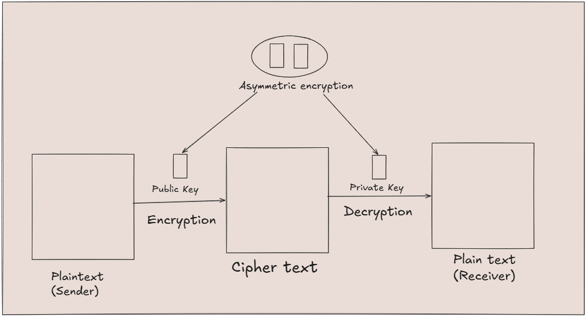

# Introduction
We will be exploring how Base64 works in the SMTP (simple mail transfer protocal) for converting raw binary data like images into text for transmission in the network.

## tools used
1. Base64 one
2. Wireshark 

## Procedure to see the work of Base64 encoding in SMTP.

# STEP 1
